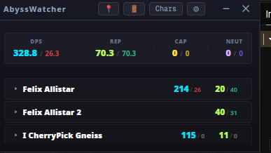
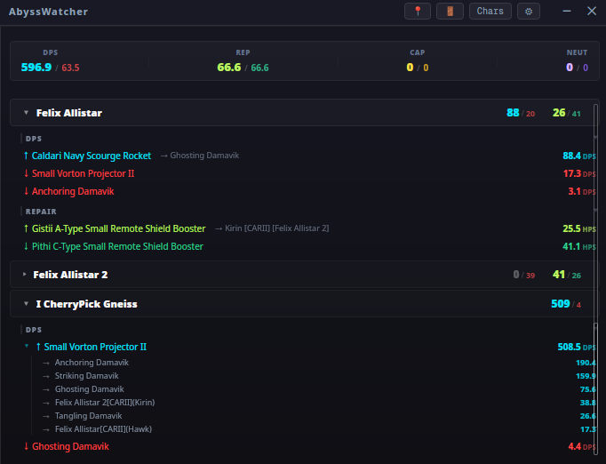
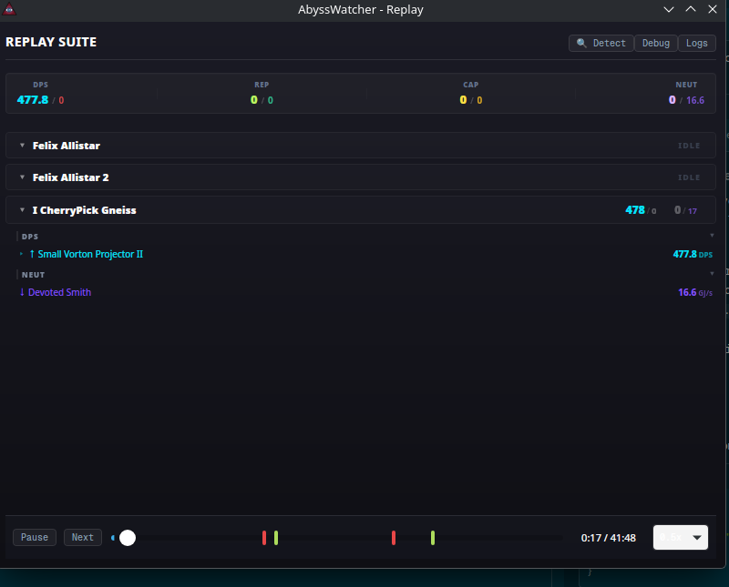
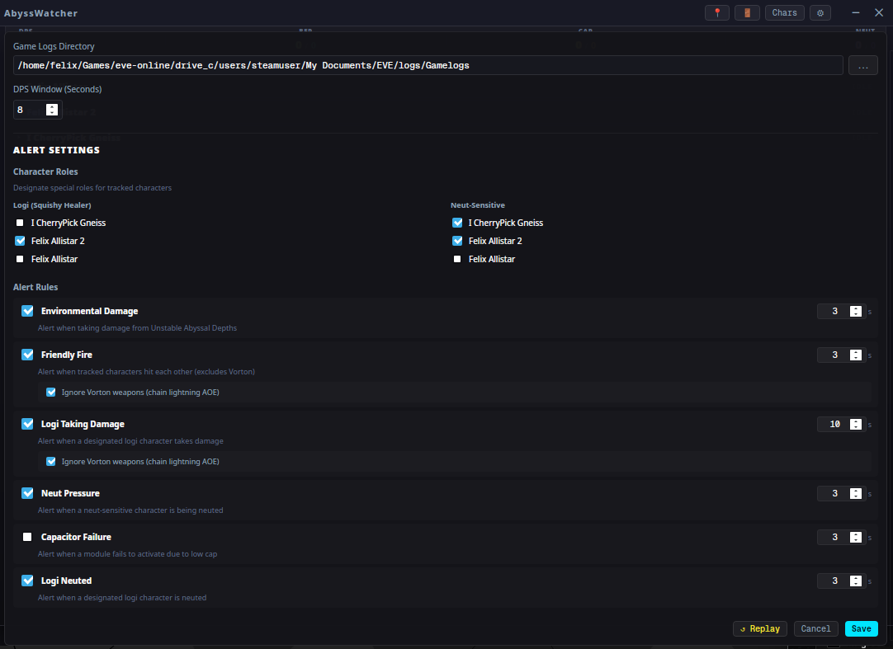

# AbyssWatcher

**AbyssWatcher** is a lightweight, always-on-top DPS meter for EVE Online, focused on Abyssal Deadspace, eaturing timestamps on logs, replay, and audio alerts.

## What it does

### Zero-Clutter HUD
Keep it tiny to just see the numbers, or expand it to see exactly who's doing what.




### Smart Replay Suite
Finished a run? Scrub through the whole thing with the timeline. You get a full breakdown of every action with timestamps so you can see where things went wrong (or right).



### Tactical Alerts
Get audio pings for the stuff that matters—like being neuted, logi taking damage, or accidentally shooting your other tracked characters (multibox Friendly Fire).



---

## Pro Tips

### Using the Logs
AbyssWatcher works by tailing your EVE Gamelogs in real-time. Just point it at your EVE logs folder (usually `Documents/EVE/logs/Gamelogs`) in the settings. It automatically picks up new logs as you log in characters.

### Bookmarks & Filaments
We use a clever trick to mark your Abyss runs directly in the log files:
- **Manual Markers**: Use the bookmark/highlight buttons on the main HUD to drop an "inline bookmark" into your log file right when something cool happens.
- **Auto-Detect**: Hit the **DETECT FILAMENTS** button in the Replay Suite. It scans your logs for filament activation events and automatically drops `RunStart` and `RunEnd` bookmarks so your timeline is perfectly partitioned.

## Quick Start

1. **Download**: Grab the latest for [Windows, Linux, or macOS](../../releases).
2. **Setup**: Set your Gamelog path in Settings.
3. **Go**: Toggle your pilots in the top dropdown and you're tracking.

## Building it

If you want to build from source, you'll need Rust, Node, and pnpm.

```bash
pnpm install
cargo tauri build
```
*Don't use `cargo install`—it won't bundle the frontend!*

## License
MIT
